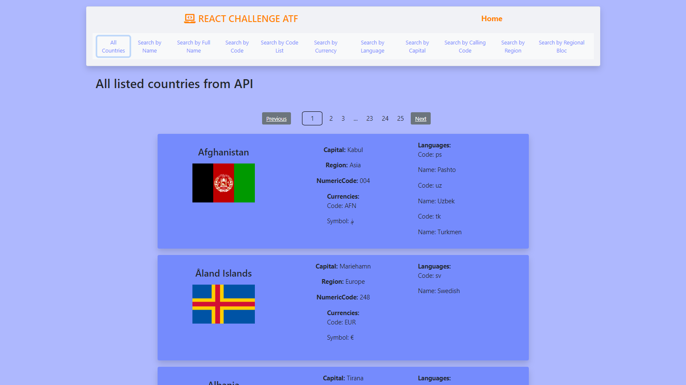
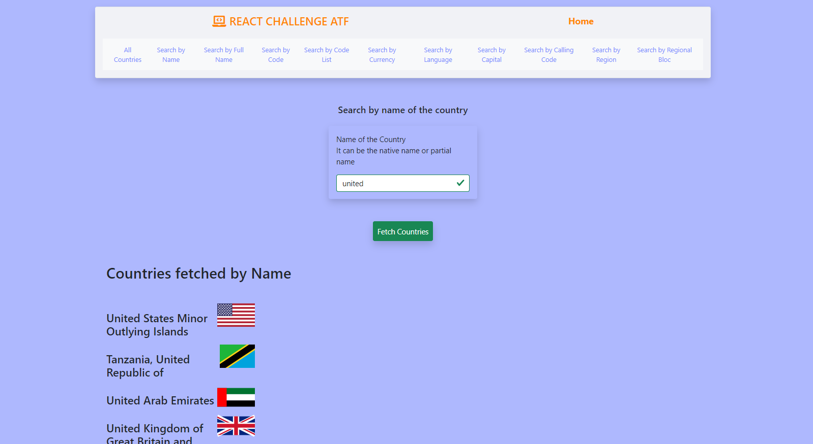

# Frontend task using ReactJS for Whale & Jaguar

This project is part of the process for a job application in Whale & Jaguar. The project is based on a Back End Rest API project that contains a list of countries and I must render that information Front End using ReactJS.
The API allows different ways to navigate and search the information and it is displayed through each link on the navbar.

## Features of the Search on the API

The API allows the user to search the information through the following information:
- Name or partial name of the country
- Full name of the country
- Code of the country
- By three codes of the country
- Currency
- Languages
- Capital
- Calling Code
- Region
- Regional Bloc

## Built With

- JavaScript
- ReactJS
- Boostrap
- ReactBoostrap

## Getting Started

To get a local copy up and follow these simple example steps.

### Prerequisites

- Local Machine installed [Nodejs](https://nodejs.org/en/download/)
- Yarn as a package manager
- A code editor as [Visual Studio](https://code.visualstudio.com/download), Sublime,etc.

### Setup

- Please make a local copy of this repo by typing this command on your terminal.

`git clone https://github.com/alejandrotoledoweb/jaguar_and_whale_challenge.git`

- Then, go to the folder created with:

`cd whale_and_jaguar_challenge`

## Available Scripts

In the project directory, you can run:

### `yarn start`

Before running this command be sure to run `npm i` to install all dependencies.

Runs the app in the development mode.\
Open [http://localhost:3000](http://localhost:3000) to view it in the browser.

The page will reload if you make edits.\
You will also see any lint errors in the console.

### `yarn build`

Builds the app for production to the `build` folder.\
It correctly bundles React in production mode and optimizes the build for the best performance.

The build is minified and the filenames include the hashes.\
Your app is ready to be deployed!

See the section about [deployment](https://facebook.github.io/create-react-app/docs/deployment) for more information.

### `yarn eject`

**Note: this is a one-way operation. Once you `eject`, you can’t go back!**

If you aren’t satisfied with the build tool and configuration choices, you can `eject` at any time. This command will remove the single build dependency from your project.

Instead, it will copy all the configuration files and the transitive dependencies (webpack, Babel, ESLint, etc) right into your project so you have full control over them. All of the commands except `eject` will still work, but they will point to the copied scripts so you can tweak them. At this point, you’re on your own.

You don’t have to ever use `eject`. The curated feature set is suitable for small and middle deployments, and you shouldn’t feel obligated to use this feature. However, we understand that this tool wouldn’t be useful if you couldn’t customize it when you are ready for it.

## Authors

👤  **Alejandro Toledo**

- GitHub: [@alejandrotoledoweb](https://github.com/alejandrotoledoweb)
- Twitter: [@alejot](https://twitter.com/alejot)
- LinkedIn: [Alejandro Toledo](https://www.linkedin.com/in/alejandro-toledo-freire/)

## 🤝 Contributing

Contributions, issues, and feature requests are welcome!

Feel free to check the [issues page](https://github.com/alejandrotoledoweb/jaguar_and_whale_challenge/issues).

## Show your support

Give a ⭐️ if you like this project!

## Acknowledgments

- Thank you to Whale & Jaguar, who challenged me to build this app.

## 📝 License

This project is [MIT](lic.url) licensed.
This project was bootstrapped with [Create React App](https://github.com/facebook/create-react-app).
